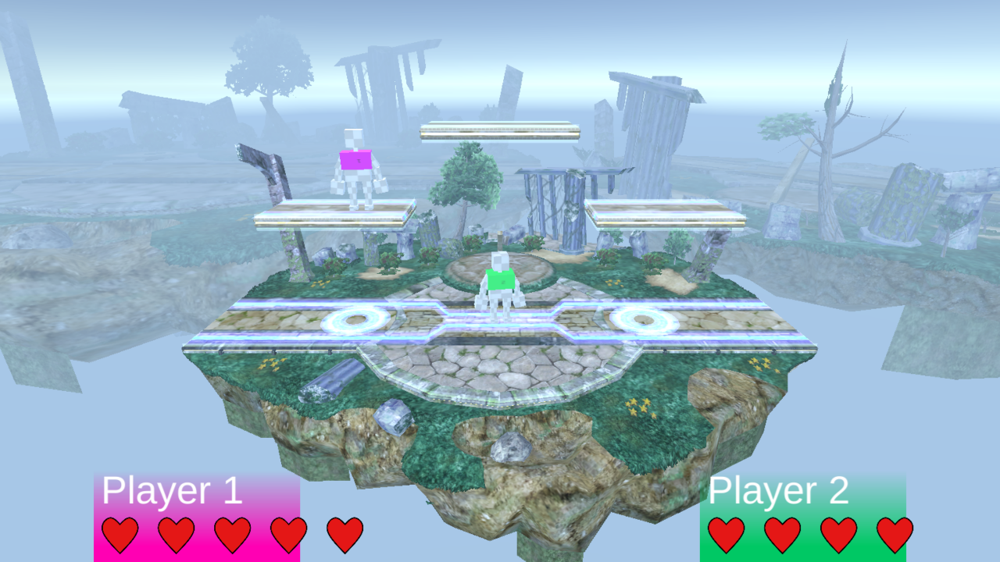

# *Smash Reborn*

*Coding Night* du 19/10/2019

## Description

*Smash Reborn* est un jeu de plateforme dans lequel deux joueurs s'affrontent. Le joueur gagnant est celui réussissant à expulser l'autre joueur de la plateforme le plus grand nombre de fois.

## Commandes

**Joueur 1 :**

- Gauche : `[Q]`
- Droite : `[D]`
- Sauter : `[Space]`
- Descendre : `[S]`
- Sprint : `[Left Shift]`
- Attaquer : `[R]`

**Joueur 2 :**

- Gauche : `[Left Arrow]`
- Droite : `[Right Arrow]`
- Sauter : `[Up Arrow]`
- Descendre : `[Down Arrow]`
- Sprint : `[Right Shift]`
- Attaquer : `[M]`
