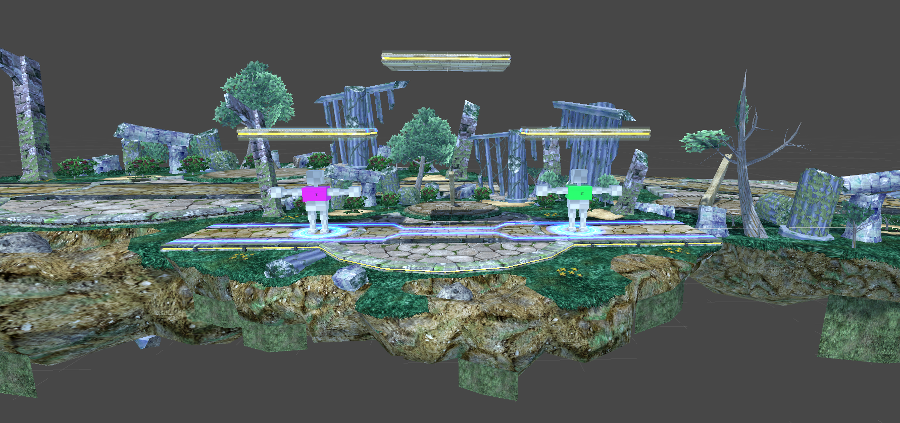

# *Smash Reborn*

*Coding Night* du 19/10/2018

## Avertissement liminaire

Ce dépôt n'est plus maintenu et subsiste uniquement en tant qu'archive.

Les jeux suivants ne disposent plus d'aucun support connu :

- [tgd-smash-reborn](https://github.com/TeleGD/tgd-smash-reborn)

# Smash Reborn
Smash Reborn est un jeu de plateforme dans lequel deux joueurs s'affrontent. Le joueur gagnant est celui réussissant à expulser l'autre joueur de la plateforme le plus grand nombre de fois.

## Installation
Pour installer le jeu il faut cloner le dépôt ([comment cloner un dépot?]https://docs.gitlab.com/ee/university/training/topics/getting_started.html#instantiate-workflow-with-clone) ), puis executer le fichier tgd-smash-reborn.exe présent dans le dossier Build

## Commandes
* *Joueur 1*
- Droite: q
- Gauche: d
- Sauter: space
- Descendre: s
- Sprint: left-shift
- Attaquer: r

* *Joueur 2*
- Droite: left-arrow 
- Gauche: right-arrow
- Sauter: up-arrow
- Descendre: down-arrow
- Sprint: right-shift
- Attaquer: m

Le jeu est aussi jouable via console.

## Réalisé à l aide de
* [Unity](https://unity.com/)

## Version

## Auteurs
* **Stéphane Hulot** - [Jonathan J](https://github.com/stephane-hulot)
* **Timothee Wright** - [Timothee W](http://www.timotheewright.ovh/)
* **Amos** - [Amos](https://github.com/AmosGeorge)
* **Alexis Dieu** - [Alexis D](https://github.com/shdaemon)
* **Adrien Cabon** - [Adrien C](https://github.com/AdrienCabon)
* **Clément Crouzet** - [Clément C](https://github.com/CrouzetC)
* **Tristan** - [Tristan](https://github.com/TrisTOON)

## License
